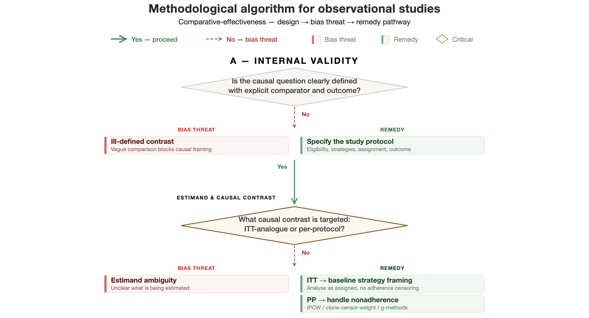

# From Association to Illusion: A Bias Assessment Algorithm for Observational Studies

An interactive, structured algorithm for evaluating methodological bias in observational comparative-effectiveness research.

## Live Demo

**[View the Algorithm](https://ihtanboga.github.io/bias-assessment-algorithm/)**

## Overview

This algorithm follows a **design → bias threat → remedy** logic. Each step asks whether a key component of a hypothetical randomized trial has been clearly and validly reproduced in the observational setting.

The structure covers:

- **Internal Validity**: causal question, estimand, eligibility, source population, treatment classification, time-zero alignment, confounding, outcome ascertainment, censoring, adherence, missing data, and analytic robustness
- **Evidence Dissemination & Interpretation**: whether conclusions are appropriately restrained and reporting is complete

## How to Use

1. Start from the top of the flowchart
2. For each diamond-shaped checkpoint, assess whether the criterion is met
3. If **Yes** — proceed to the next checkpoint
4. If **No** — review the identified bias threat and consider the suggested remedy
5. A study that passes all checkpoints has no major design-related bias identified within this framework

## Key Features

- Dark/light mode support (follows system preference)
- Responsive design
- Color-coded bias threats (red) and remedies (green)
- Critical checkpoints highlighted (amber)
- Operationalization checkpoints distinguished (blue-grey)

## Citation

If you use this algorithm in your work, please cite appropriately.

## License

This work is provided as a practical methodological guide for educational and research purposes.
